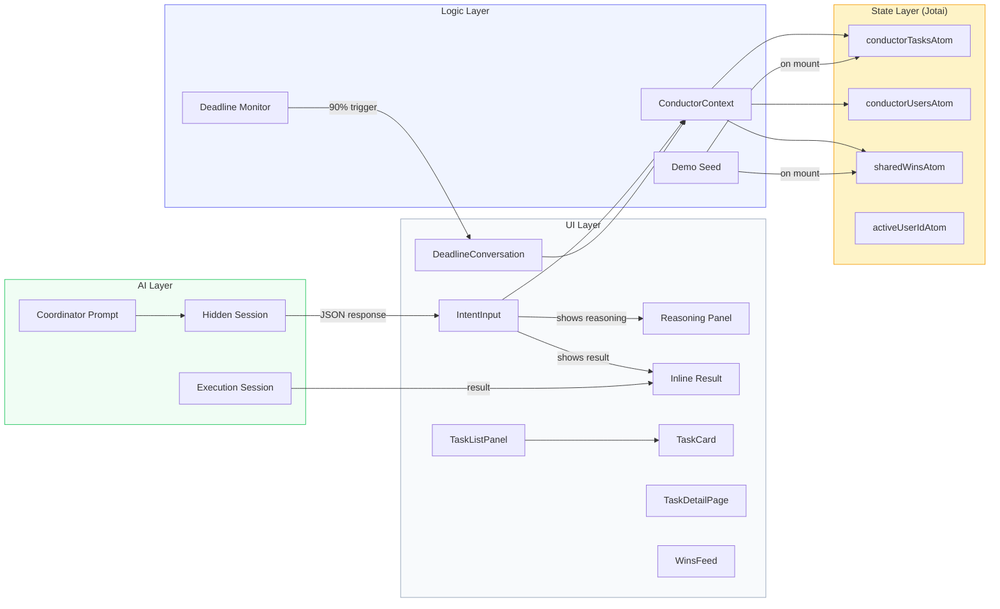

# Conductor Demo Polish: PRD + Implementation Plan

## Context

The Conductor feature is built (types, atoms, navigation, context, 8 UI components, AppShell integration). However, the current implementation doesn't match the **60-second pitch demo** the user wants to present. This plan closes the gaps between what's built and what the demo script requires — specifically 3 rapid-fire beats that showcase intent routing, AI self-execution, and conversational reassignment.

---

## PRD: Demo-Aligned Product Requirements

### The Pitch (60 seconds)

> "Slack is a chat app pretending to be a work tool. We built a work router — AI handles coordination, humans do what humans do best."

### Demo Cast

| User | ID | Role | Skills | Demo Role |
|------|-----|------|--------|-----------|
| Sarah Chen | `sarah` | Engineer | code, typescript, react, api-design, testing | **Requester** (default user) |
| Jordan Rivers | `jordan` | Data Analyst | data, analysis, sql, spreadsheets, visualization, python | **Assignee** for Beat 1 + 3 |
| Alex Park | `alex` | PM | planning, writing, analysis, spreadsheets, user-research, roadmapping | **Reassignment target** for Beat 3 |

### Beat 1: Intent → Smart Assignment

**User action**: Sarah types "I need a summary of last week's onboarding metrics by Friday."

**What the audience sees**:
1. Sarah's input in the text area
2. AI reasoning appears inline (not a toast): *"Assigning to Jordan Rivers (Data Analyst, 83% skill match, 66% capacity). Jordan won't know it's from you — keeping it anonymous to remove bias."*
3. Task card appears in the task list with `assigned` status

**Key moments**: Skill matching visible, capacity visible, anonymity explained.

### Beat 2: AI Does It Itself

**User action**: Sarah types "Write a 3-paragraph team update about our shipping milestone."

**What the audience sees**:
1. AI reasoning appears inline: *"This doesn't require a human. Working on it..."*
2. Spinner for 2-3 seconds
3. Result appears inline below the reasoning — full 3-paragraph output with a green "Done" badge
4. No navigation away — everything stays in the IntentInput view

**Key moment**: AI completes the task without involving any human. Instant. Crowd-pleaser.

### Beat 3: Conversational Reassignment

**User action**: Demo presenter triggers the 90% deadline check (pre-seeded task at ~89% progress).

**What the audience sees**:
1. Dialog pops up (from Jordan's perspective): *"Hey Jordan, your task 'Onboarding metrics dashboard' is due in 3 hours — will you be able to finish in time?"*
2. Jordan clicks "No, can't finish"
3. AI responds: *"No worries. Reassigning to Alex Park — same skill set, 40% capacity, available now. All stakeholders notified."*
4. Task moves from Jordan's queue to Alex's
5. Toast: "Task reassigned to Alex Park"

**Key moment**: AI mediates human workload — no awkward DMs, no blame.

### Mermaid Diagram: Demo Flow

```mermaid
flowchart TD
    subgraph BEAT1["Beat 1: Intent → Assignment"]
        A1[Sarah types intent] --> A2[Coordinator AI parses]
        A2 --> A3{Execution tier?}
        A3 -->|human / ai_agent| A4[findBestAssignee]
        A4 --> A5[Show reasoning inline:<br/>'Assigning to Jordan Rivers<br/>83% skill match, 66% capacity.<br/>Anonymous to remove bias.']
        A5 --> A6[Create task → assigned status]
        A6 --> A7[Task appears in Jordan's list]
    end

    subgraph BEAT2["Beat 2: AI Direct Execution"]
        B1[Sarah types intent] --> B2[Coordinator AI parses]
        B2 --> B3{Execution tier?}
        B3 -->|ai_direct| B4[Show reasoning inline:<br/>'This doesn't require a human.<br/>Working on it...']
        B4 --> B5[AI executes in hidden session]
        B5 --> B6[Result appears inline<br/>with green 'Done' badge]
        B6 --> B7[Auto-complete + add to Wins]
    end

    subgraph BEAT3["Beat 3: Conversational Reassignment"]
        C1[Pre-seeded task at 89%<br/>deadline progress] --> C2[Deadline monitor fires<br/>at 90% threshold]
        C2 --> C3[Dialog: 'Hey Jordan,<br/>can you finish in time?']
        C3 --> C4{Jordan responds}
        C4 -->|'No, can't finish'| C5[AI: 'No worries.<br/>Reassigning to Alex Park.']
        C5 --> C6[reassignTask → Alex]
        C6 --> C7[Task moves to Alex's queue<br/>+ toast notification]
        C4 -->|'Yes, almost done'| C8[AI: 'Great!'<br/>Dialog closes]
    end

    style BEAT1 fill:#f0f4ff,stroke:#6366f1,stroke-width:2px
    style BEAT2 fill:#f0fdf4,stroke:#22c55e,stroke-width:2px
    style BEAT3 fill:#fff7ed,stroke:#f59e0b,stroke-width:2px
```

### Mermaid Diagram: System Architecture

---

## Implementation Plan

### 1. Rename users to match demo script

**File**: `apps/electron/src/renderer/config/conductor-users.ts`

| Old | New | ID | Role | Skills |
|-----|-----|----|------|--------|
| Alice Chen | Sarah Chen | `sarah` | Engineer | code, typescript, react, api-design, testing |
| Bob Kim | Jordan Rivers | `jordan` | Data Analyst | data, analysis, sql, spreadsheets, visualization, python |
| Carla Davis | Alex Park | `alex` | PM | planning, writing, analysis, spreadsheets, user-research, roadmapping |

- Update `CONDUCTOR_USERS` array
- Change `DEFAULT_USER_ID` from `'alice'` to `'sarah'`
- Update `USER_COLORS` keys: `alice→sarah`, `bob→jordan`, `carla→alex`

### 2. Add visible AI reasoning to IntentInput

**File**: `apps/electron/src/renderer/components/conductor/IntentInput.tsx`

Changes:
- Add `reasoningMessage` and `inlineResult` state
- After coordinator JSON is parsed, build a natural-language reasoning message:
  - For `human`/`ai_agent`: `"Assigning to {name} ({role}, {skillMatch}% skill match, {capacity}% capacity). {name} won't know it's from you — keeping it anonymous to remove bias."`
  - For `ai_direct`: `"This doesn't require a human. Working on it..."`
- Display reasoning in a styled card below the input (with Sparkles icon)
- For `ai_direct` tasks: show result inline with green "Done" badge instead of navigating away
- Update suggestion chips to match demo examples:
  - `"I need a summary of last week's onboarding metrics by Friday"`
  - `"Write a 3-paragraph team update about our shipping milestone"`
  - `"Design a landing page for our enterprise launch"`

### 3. Add deadline parsing to coordinator prompt

**File**: `apps/electron/src/renderer/lib/conductor-prompt.ts`

Changes:
- Add deadline parsing section to system prompt with examples ("by Friday" → timestamp)
- Add `nextFriday5pm()` helper to inject concrete reference timestamps
- Add `deadline` field to JSON output format documentation

### 4. Create DeadlineConversation dialog

**New file**: `apps/electron/src/renderer/components/conductor/DeadlineConversation.tsx`

A dialog component that simulates the AI checking in with the assignee:
- Shows pre-scripted AI message: `"Hey {firstName}, your task '{title}' is due in {timeLeft} — will you be able to finish in time?"`
- Two buttons: "No, can't finish" / "Yes, almost done"
- On "No": shows user response → AI reassignment message → triggers `reassignTask()` → closes after 2s
- On "Yes": shows "Great!" → closes

### 5. Wire DeadlineConversation into ConductorContext

**File**: `apps/electron/src/renderer/context/ConductorContext.tsx`

Changes:
- Add `deadlineCheckTask` state (the task ID that triggered 90% check, or `null`)
- Add `dismissDeadlineCheck` function
- Expose both on `ConductorContextType`
- Replace auto-reassign at 90% with: `setDeadlineCheckTask(task.id)` (triggers dialog instead)

### 6. Render DeadlineConversation in MainContentPanel (or AppShell)

**File**: `apps/electron/src/renderer/components/app-shell/AppShell.tsx` (or a wrapper)

Changes:
- Read `deadlineCheckTask` from `useConductor()`
- When non-null, render `<DeadlineConversation>` dialog overlay
- On reassign callback: call `findBestAssignee` + `reassignTask` from context

### 7. Create demo seed data

**New file**: `apps/electron/src/renderer/config/conductor-demo-seed.ts`

Pre-loaded state for reliable demo:
- 1 completed task (in Wins feed): "Customer satisfaction report Q4" completed by Jordan
- 1 in-progress task at ~89% deadline: "Onboarding metrics dashboard" assigned to Jordan, deadline ~1h from now
  - `escalationState.checkedAt50: true, warnedAt75: true, reassignedAt90: false`

### 8. Load demo seed on mount

**File**: `apps/electron/src/renderer/context/ConductorContext.tsx`

Changes:
- Import demo seed data
- Add `useEffect` on mount to seed tasks and wins into atoms (always seed for hackathon — no feature flag needed)
- Seed Jordan's `currentTaskIds` to include the in-progress task

### 9. Export DeadlineConversation from barrel

**File**: `apps/electron/src/renderer/components/conductor/index.ts`

- Add `export { DeadlineConversation } from './DeadlineConversation'`

---

## Files Summary

| File | Action | What Changes |
|------|--------|-------------|
| `config/conductor-users.ts` | **Modify** | Rename Alice→Sarah, Bob→Jordan, Carla→Alex; update skills, colors, default |
| `components/conductor/IntentInput.tsx` | **Modify** | Add reasoning display, inline results, updated suggestion chips |
| `lib/conductor-prompt.ts` | **Modify** | Add deadline parsing section + helper |
| `components/conductor/DeadlineConversation.tsx` | **Create** | Conversational dialog for 90% deadline check |
| `context/ConductorContext.tsx` | **Modify** | Add deadlineCheckTask state, replace auto-reassign with dialog trigger, seed demo data |
| `components/app-shell/AppShell.tsx` | **Modify** | Render DeadlineConversation when triggered |
| `config/conductor-demo-seed.ts` | **Create** | Pre-seeded tasks + wins for reliable demo |
| `components/conductor/index.ts` | **Modify** | Export DeadlineConversation |

**Total**: 6 modified files, 2 new files.

---

## Verification Plan

1. `bun run typecheck:all` — zero new errors
2. `bun run electron:dev` — app loads with Sarah as default user
3. Wins feed shows pre-seeded "Customer satisfaction report Q4" by Jordan
4. All Tasks shows Jordan's in-progress "Onboarding metrics dashboard" with deadline indicator
5. **Beat 1 test**: Type "I need a summary of last week's onboarding metrics by Friday" → reasoning card appears inline with assignment explanation → task created
6. **Beat 2 test**: Type "Write a 3-paragraph team update about our shipping milestone" → "This doesn't require a human" message → result appears inline with Done badge
7. **Beat 3 test**: Wait for 90% deadline on pre-seeded task (or reduce deadline to trigger sooner) → DeadlineConversation dialog appears → click "No, can't finish" → reassignment happens → task moves to Alex's queue
8. Switch to Jordan view → verify task disappeared from their list
9. Switch to Alex view → verify task appeared in their list
