# Dispatch: PRD + Implementation Status

## Context

Dispatch is an AI-native task coordination system for B2B teams. Instead of chat-based communication, team members tell the system what they need, and a central AI intelligently routes tasks to the best-qualified available person - or completes the task autonomously if possible.

**Current Status**:
- ✅ Frontend UI components built (types, atoms, navigation, context, 8 UI components)
- ✅ Backend API implemented (packages/backend)
- ✅ Database schema designed (Neon + Drizzle ORM)
- ✅ AI coordinator service with Claude API
- ✅ WebSocket support for real-time updates
- 🚧 Frontend-backend integration (in progress)
- ⏳ Demo polish and testing

---

## PRD: Demo-Aligned Product Requirements

### The Pitch (60 seconds)

> "Slack is a chat app pretending to be a work tool. We built a work router — AI handles coordination, humans do what humans do best."

### Demo Cast

| User | ID | Role | Skills | Demo Role |
|------|-----|------|--------|-----------|
| Sarah Chen | `sarah` | Engineer | code, typescript, react, api-design, testing | **Requester** (default user) |
| Jordan Rivers | `jordan` | Data Analyst | data, analysis, sql, spreadsheets, visualization, python | **Assignee** for Beat 1 + 3 |
| Alex Park | `alex` | PM | planning, writing, analysis, spreadsheets, user-research, roadmapping | **Reassignment target** for Beat 3 |

### Beat 1: Intent → Smart Assignment

**User action**: Sarah types "I need a summary of last week's onboarding metrics by Friday."

**What the audience sees**:
1. Sarah's input in the text area
2. AI reasoning appears inline (not a toast): *"Assigning to Jordan Rivers (Data Analyst, 83% skill match, 66% capacity). Jordan won't know it's from you — keeping it anonymous to remove bias."*
3. Task card appears in the task list with `assigned` status

**Key moments**: Skill matching visible, capacity visible, anonymity explained.

### Beat 2: AI Does It Itself

**User action**: Sarah types "Write a 3-paragraph team update about our shipping milestone."

**What the audience sees**:
1. AI reasoning appears inline: *"This doesn't require a human. Working on it..."*
2. Spinner for 2-3 seconds
3. Result appears inline below the reasoning — full 3-paragraph output with a green "Done" badge
4. No navigation away — everything stays in the IntentInput view

**Key moment**: AI completes the task without involving any human. Instant. Crowd-pleaser.

### Beat 3: Conversational Reassignment

**User action**: Demo presenter triggers the 90% deadline check (pre-seeded task at ~89% progress).

**What the audience sees**:
1. Dialog pops up (from Jordan's perspective): *"Hey Jordan, your task 'Onboarding metrics dashboard' is due in 3 hours — will you be able to finish in time?"*
2. Jordan clicks "No, can't finish"
3. AI responds: *"No worries. Reassigning to Alex Park — same skill set, 40% capacity, available now. All stakeholders notified."*
4. Task moves from Jordan's queue to Alex's
5. Toast: "Task reassigned to Alex Park"

**Key moment**: AI mediates human workload — no awkward DMs, no blame.

### Mermaid Diagram: Demo Flow

```mermaid
flowchart TD
    subgraph BEAT1["Beat 1: Intent → Assignment"]
        A1[Sarah types intent] --> A2[Coordinator AI parses]
        A2 --> A3{Execution tier?}
        A3 -->|human / ai_agent| A4[findBestAssignee]
        A4 --> A5[Show reasoning inline:<br/>'Assigning to Jordan Rivers<br/>83% skill match, 66% capacity.<br/>Anonymous to remove bias.']
        A5 --> A6[Create task → assigned status]
        A6 --> A7[Task appears in Jordan's list]
    end

    subgraph BEAT2["Beat 2: AI Direct Execution"]
        B1[Sarah types intent] --> B2[Coordinator AI parses]
        B2 --> B3{Execution tier?}
        B3 -->|ai_direct| B4[Show reasoning inline:<br/>'This doesn't require a human.<br/>Working on it...']
        B4 --> B5[AI executes in hidden session]
        B5 --> B6[Result appears inline<br/>with green 'Done' badge]
        B6 --> B7[Auto-complete + add to Wins]
    end

    subgraph BEAT3["Beat 3: Conversational Reassignment"]
        C1[Pre-seeded task at 89%<br/>deadline progress] --> C2[Deadline monitor fires<br/>at 90% threshold]
        C2 --> C3[Dialog: 'Hey Jordan,<br/>can you finish in time?']
        C3 --> C4{Jordan responds}
        C4 -->|'No, can't finish'| C5[AI: 'No worries.<br/>Reassigning to Alex Park.']
        C5 --> C6[reassignTask → Alex]
        C6 --> C7[Task moves to Alex's queue<br/>+ toast notification]
        C4 -->|'Yes, almost done'| C8[AI: 'Great!'<br/>Dialog closes]
    end

    style BEAT1 fill:#f0f4ff,stroke:#6366f1,stroke-width:2px
    style BEAT2 fill:#f0fdf4,stroke:#22c55e,stroke-width:2px
    style BEAT3 fill:#fff7ed,stroke:#f59e0b,stroke-width:2px
```



### Mermaid Diagram: System Architecture


---

## Backend Architecture (Implemented)

### Tech Stack
- **Runtime**: Bun
- **Framework**: Hono (HTTP + WebSocket)
- **Database**: Neon (Serverless Postgres)
- **ORM**: Drizzle
- **AI**: Anthropic Claude API (Sonnet 4.5)

### Database Schema

**users** - Demo users (Sarah, Jordan, Alex)
```sql
- id: text (primary key) - 'sarah', 'jordan', 'alex'
- name: text
- email: text
- role: text
- skills: text[] - Array of skills
- currentCapacity: integer - Active task count
- maxCapacity: integer - Max concurrent tasks
```

**tasks** - All task records
```sql
- id: uuid (primary key)
- title: text
- description: text
- deadline: timestamp
- priority: text - 'low' | 'medium' | 'high' | 'urgent'
- requiredSkills: text[]
- status: text - 'pending' | 'assigned' | 'in_progress' | 'completed'
- requesterId: text (FK to users)
- assigneeId: text (FK to users)
- aiCompleted: boolean - True if AI did it autonomously
- aiResult: text - Result for AI direct execution
- progressPercentage: integer - 0-100
```

**messages** - Task-scoped chat threads
```sql
- id: uuid (primary key)
- userId: text (FK to users) - Null for system messages
- content: text
- role: text - 'user' | 'assistant'
- taskId: uuid (FK to tasks) - Links to task thread
```

**assignment_history** - Track reassignments
```sql
- id: uuid (primary key)
- taskId: uuid (FK to tasks)
- fromUserId: text (FK to users)
- toUserId: text (FK to users)
- reason: text
```

**task_checkins** - Deadline check-in responses
```sql
- id: uuid (primary key)
- taskId: uuid (FK to tasks)
- response: text - 'on_track' | 'blocked' | 'cant_do'
- notes: text
```

### API Endpoints

**Chat**
- `POST /api/chat` - Send message to AI coordinator, creates task

**Tasks**
- `GET /api/tasks/my-tasks` - Tasks assigned to current user
- `GET /api/tasks/sent` - Tasks requested by current user
- `GET /api/tasks/done` - Completed tasks
- `GET /api/tasks/:id` - Task details with messages
- `POST /api/tasks/:id/complete` - Mark task complete
- `PATCH /api/tasks/:id/progress` - Update progress percentage
- `POST /api/tasks/:id/reassign` - Reassign task to another user

**Users**
- `GET /api/users/me` - Current user info
- `GET /api/users` - List all users

**WebSocket**
- `ws://localhost:3001/ws` - Real-time updates
  - Events: `task:created`, `task:updated`, `task:completed`, `task:reassigned`, `message:new`

### AI Coordinator Logic

The AI coordinator (`packages/backend/src/services/ai-coordinator.ts`) uses Claude to:

1. **Parse user intent** - Extract task details from natural language
2. **Determine execution tier**:
   - `ai_direct` - AI completes task immediately (writing, analysis, etc.)
   - `human` - Requires human skills, assigns to best match
   - `ai_agent` - Complex tasks with tool use (future)
3. **For human tasks**: Find best assignee using assignment algorithm
4. **For AI direct**: Execute with Claude and return result
5. **Store everything** in database with proper relationships

### Task Assignment Algorithm

(`packages/backend/src/services/task-assignment.ts`)

```typescript
function findBestAssignee(task):
  1. Get all users
  2. Filter by: currentCapacity < maxCapacity
  3. Calculate skill match percentage
  4. Filter by: has at least one required skill (or no skills required)
  5. Sort by: available capacity DESC, then skill match DESC
  6. Return top match
```

### Deadline Monitor

(`packages/backend/src/services/deadline-monitor.ts`)

Background job that checks every 5 minutes:
- Calculate time progress: (elapsed / total) * 100
- At 50% time: Check if progress < 25%, send check-in
- At 75% time: Check if progress < 50%, send warning
- At 90% time: Check if progress < 75%, trigger reassignment dialog

### Authentication (Hackathon Mode)

- **Current**: Hardcoded demo users, no auth
- Frontend sends `X-User-Id` header with each request
- Backend trusts header (no validation)
- **Post-hackathon**: Implement proper auth with better-auth

---

## Frontend Implementation Plan

### 1. Rename users to match demo script

**File**: `apps/electron/src/renderer/config/dispatch-users.ts`

| Old | New | ID | Role | Skills |
|-----|-----|----|------|--------|
| Alice Chen | Sarah Chen | `sarah` | Engineer | code, typescript, react, api-design, testing |
| Bob Kim | Jordan Rivers | `jordan` | Data Analyst | data, analysis, sql, spreadsheets, visualization, python |
| Carla Davis | Alex Park | `alex` | PM | planning, writing, analysis, spreadsheets, user-research, roadmapping |

- Update `DISPATCH_USERS` array
- Change `DEFAULT_USER_ID` from `'alice'` to `'sarah'`
- Update `USER_COLORS` keys: `alice→sarah`, `bob→jordan`, `carla→alex`

### 2. Add visible AI reasoning to IntentInput

**File**: `apps/electron/src/renderer/components/dispatch/IntentInput.tsx`

Changes:
- Add `reasoningMessage` and `inlineResult` state
- After coordinator JSON is parsed, build a natural-language reasoning message:
  - For `human`/`ai_agent`: `"Assigning to {name} ({role}, {skillMatch}% skill match, {capacity}% capacity). {name} won't know it's from you — keeping it anonymous to remove bias."`
  - For `ai_direct`: `"This doesn't require a human. Working on it..."`
- Display reasoning in a styled card below the input (with Sparkles icon)
- For `ai_direct` tasks: show result inline with green "Done" badge instead of navigating away
- Update suggestion chips to match demo examples:
  - `"I need a summary of last week's onboarding metrics by Friday"`
  - `"Write a 3-paragraph team update about our shipping milestone"`
  - `"Design a landing page for our enterprise launch"`

### 3. Add deadline parsing to coordinator prompt

**File**: `apps/electron/src/renderer/lib/dispatch-prompt.ts`

Changes:
- Add deadline parsing section to system prompt with examples ("by Friday" → timestamp)
- Add `nextFriday5pm()` helper to inject concrete reference timestamps
- Add `deadline` field to JSON output format documentation

### 4. Create DeadlineConversation dialog

**New file**: `apps/electron/src/renderer/components/dispatch/DeadlineConversation.tsx`

A dialog component that simulates the AI checking in with the assignee:
- Shows pre-scripted AI message: `"Hey {firstName}, your task '{title}' is due in {timeLeft} — will you be able to finish in time?"`
- Two buttons: "No, can't finish" / "Yes, almost done"
- On "No": shows user response → AI reassignment message → triggers `reassignTask()` → closes after 2s
- On "Yes": shows "Great!" → closes

### 5. Wire DeadlineConversation into DispatchContext

**File**: `apps/electron/src/renderer/context/DispatchContext.tsx`

Changes:
- Add `deadlineCheckTask` state (the task ID that triggered 90% check, or `null`)
- Add `dismissDeadlineCheck` function
- Expose both on `DispatchContextType`
- Replace auto-reassign at 90% with: `setDeadlineCheckTask(task.id)` (triggers dialog instead)

### 6. Render DeadlineConversation in MainContentPanel (or AppShell)

**File**: `apps/electron/src/renderer/components/app-shell/AppShell.tsx` (or a wrapper)

Changes:
- Read `deadlineCheckTask` from `useDispatch()`
- When non-null, render `<DeadlineConversation>` dialog overlay
- On reassign callback: call `findBestAssignee` + `reassignTask` from context

### 7. Create demo seed data

**New file**: `apps/electron/src/renderer/config/dispatch-demo-seed.ts`

Pre-loaded state for reliable demo:
- 1 completed task (in Wins feed): "Customer satisfaction report Q4" completed by Jordan
- 1 in-progress task at ~89% deadline: "Onboarding metrics dashboard" assigned to Jordan, deadline ~1h from now
  - `escalationState.checkedAt50: true, warnedAt75: true, reassignedAt90: false`

### 8. Load demo seed on mount

**File**: `apps/electron/src/renderer/context/DispatchContext.tsx`

Changes:
- Import demo seed data
- Add `useEffect` on mount to seed tasks and wins into atoms (always seed for hackathon — no feature flag needed)
- Seed Jordan's `currentTaskIds` to include the in-progress task

### 9. Export DeadlineConversation from barrel

**File**: `apps/electron/src/renderer/components/dispatch/index.ts`

- Add `export { DeadlineConversation } from './DeadlineConversation'`

### 10. Create API Client

**New file**: `apps/electron/src/renderer/lib/api-client.ts`

Typed fetch wrapper for backend API:
```typescript
const API_BASE_URL = 'http://localhost:3001/api';

export async function sendChatMessage(message: string, userId: string)
export async function getMyTasks(userId: string)
export async function getSentTasks(userId: string)
export async function getDoneTasks(userId: string)
export async function getTaskDetails(taskId: string, userId: string)
export async function completeTask(taskId: string, userId: string)
export async function updateTaskProgress(taskId: string, progress: number, userId: string)
export async function reassignTask(taskId: string, newAssigneeId: string, reason: string)
```

All requests include `X-User-Id` header for authentication.

### 11. Create WebSocket Client

**New file**: `apps/electron/src/renderer/lib/websocket-client.ts`

WebSocket connection to backend:
```typescript
const ws = new WebSocket('ws://localhost:3001/ws');

ws.onopen = () => {
  ws.send(JSON.stringify({ type: 'subscribe:user', userId }));
};

ws.onmessage = (event) => {
  const message = JSON.parse(event.data);
  // Dispatch to Jotai atom updaters
  handleWebSocketMessage(message);
};
```

Handles events: `task:created`, `task:updated`, `task:completed`, `task:reassigned`, `message:new`

### 12. Integrate Backend API into DispatchContext

**File**: `apps/electron/src/renderer/context/DispatchContext.tsx`

Changes:
- Import API client and WebSocket client
- On mount: Connect WebSocket + fetch initial tasks from `/api/tasks/my-tasks`
- Replace mock task creation with `await sendChatMessage()`
- Update Jotai atoms on WebSocket events
- Keep atoms as client-side cache for fast UI updates

### 13. Update IntentInput to use Backend

**File**: `apps/electron/src/renderer/components/dispatch/IntentInput.tsx`

Changes:
- Call `sendChatMessage(message, userId)` instead of local AI
- Parse response and display reasoning
- For `ai_direct`: Show result inline
- For `human`: Show assignment info and create task card
- Update Jotai atoms after successful API call

---

## Files Summary

### Backend (✅ Complete)

| File | Status | Purpose |
|------|--------|---------|
| `packages/backend/package.json` | ✅ **Created** | Backend dependencies |
| `packages/backend/src/index.ts` | ✅ **Created** | Hono server entry + WebSocket |
| `packages/backend/src/db/schema.ts` | ✅ **Created** | Drizzle database schema |
| `packages/backend/src/db/client.ts` | ✅ **Created** | Neon connection |
| `packages/backend/src/db/seed.ts` | ✅ **Created** | Demo data seeder |
| `packages/backend/src/routes/tasks.ts` | ✅ **Created** | Task CRUD endpoints |
| `packages/backend/src/routes/chat.ts` | ✅ **Created** | AI chat endpoint |
| `packages/backend/src/routes/users.ts` | ✅ **Created** | User endpoints |
| `packages/backend/src/services/ai-coordinator.ts` | ✅ **Created** | Claude API integration |
| `packages/backend/src/services/task-assignment.ts` | ✅ **Created** | Assignment algorithm |
| `packages/backend/src/services/deadline-monitor.ts` | ✅ **Created** | Deadline checking |
| `packages/backend/src/websocket.ts` | ✅ **Created** | WebSocket handlers |
| `packages/backend/src/types/index.ts` | ✅ **Created** | TypeScript types |

### Frontend (🚧 In Progress)

| File | Status | Purpose |
|------|--------|---------|
| `config/dispatch-users.ts` | ⏳ **TODO** | Rename users (Alice→Sarah, etc.) |
| `components/dispatch/IntentInput.tsx` | ⏳ **TODO** | Add reasoning display, backend integration |
| `lib/dispatch-prompt.ts` | ⏳ **TODO** | Add deadline parsing |
| `components/dispatch/DeadlineConversation.tsx` | ⏳ **TODO** | Create dialog component |
| `context/DispatchContext.tsx` | ⏳ **TODO** | Backend API + WebSocket integration |
| `components/app-shell/AppShell.tsx` | ⏳ **TODO** | Render DeadlineConversation |
| `lib/api-client.ts` | ⏳ **TODO** | Create API client |
| `lib/websocket-client.ts` | ⏳ **TODO** | Create WebSocket client |
| `components/dispatch/index.ts` | ⏳ **TODO** | Export DeadlineConversation |

**Backend**: 13 files created
**Frontend**: 9 files to modify/create

---

## Setup & Development

### Initial Setup

1. **Install dependencies**:
   ```bash
   bun install
   ```

2. **Create Neon database**:
   - Go to https://neon.tech
   - Create new project (free tier)
   - Copy connection string

3. **Configure environment**:
   ```bash
   cp packages/backend/.env.example packages/backend/.env
   ```

   Edit `packages/backend/.env`:
   ```
   DATABASE_URL=your_neon_connection_string
   ANTHROPIC_API_KEY=your_claude_api_key
   PORT=3001
   ```

4. **Setup database**:
   ```bash
   bun run backend:db:setup
   ```

   This creates tables and seeds demo users (Sarah, Jordan, Alex) + sample tasks.

### Development

**Start both backend + frontend**:
```bash
bun run dev
```

**Or start separately**:
```bash
# Terminal 1 - Backend
bun run backend:dev

# Terminal 2 - Frontend
bun run electron:dev
```

**Backend commands**:
- `bun run backend:dev` - Start server
- `bun run backend:db:push` - Push schema changes
- `bun run backend:db:seed` - Re-seed database
- `bun run backend:db:setup` - Push + seed

---

## Verification Plan

### Backend Testing

1. **Health check**:
   ```bash
   curl http://localhost:3001/health
   ```

2. **Get users**:
   ```bash
   curl -H "X-User-Id: sarah" http://localhost:3001/api/users
   ```

3. **Create task via chat**:
   ```bash
   curl -X POST http://localhost:3001/api/chat \
     -H "Content-Type: application/json" \
     -H "X-User-Id: sarah" \
     -d '{"message": "I need help analyzing Q4 metrics by Friday"}'
   ```

4. **Get my tasks**:
   ```bash
   curl -H "X-User-Id: jordan" http://localhost:3001/api/tasks/my-tasks
   ```

5. **WebSocket connection**:
   - Use wscat: `wscat -c ws://localhost:3001/ws`
   - Send: `{"type":"subscribe:user","userId":"sarah"}`

### Frontend Integration Testing

1. `bun run typecheck:all` — zero new errors
2. `bun run dev` — backend + frontend start successfully
3. Electron app loads with Sarah as default user
4. Backend connection indicator shows "Connected"
5. Initial tasks load from backend API

### End-to-End Demo Testing

**Beat 1: Intent → Smart Assignment**
1. Type: "I need a summary of last week's onboarding metrics by Friday"
2. ✅ AI reasoning appears: "Assigning to Jordan Rivers (Data Analyst, 83% skill match, 66% capacity)"
3. ✅ Task appears in task list
4. ✅ Switch to Jordan → see task in their list
5. ✅ WebSocket notification received

**Beat 2: AI Direct Execution**
1. Type: "Write a 3-paragraph team update about our shipping milestone"
2. ✅ AI reasoning: "This doesn't require a human. Working on it..."
3. ✅ Result appears inline with green "Done" badge
4. ✅ Task marked as `ai_completed` in database

**Beat 3: Conversational Reassignment**
1. ✅ Pre-seeded task exists at 89% deadline (from seed script)
2. ✅ Deadline monitor triggers check-in dialog
3. ✅ Jordan clicks "No, can't finish"
4. ✅ AI reassigns to Alex
5. ✅ Task moves from Jordan's list to Alex's list
6. ✅ Both users get WebSocket notifications

### Database Verification

```sql
-- Check users
SELECT * FROM users;

-- Check tasks
SELECT id, title, status, requester_id, assignee_id, ai_completed
FROM tasks
ORDER BY created_at DESC;

-- Check messages for a task
SELECT * FROM messages WHERE task_id = 'task-uuid' ORDER BY created_at;

-- Check assignment history
SELECT * FROM assignment_history ORDER BY created_at DESC;
```
